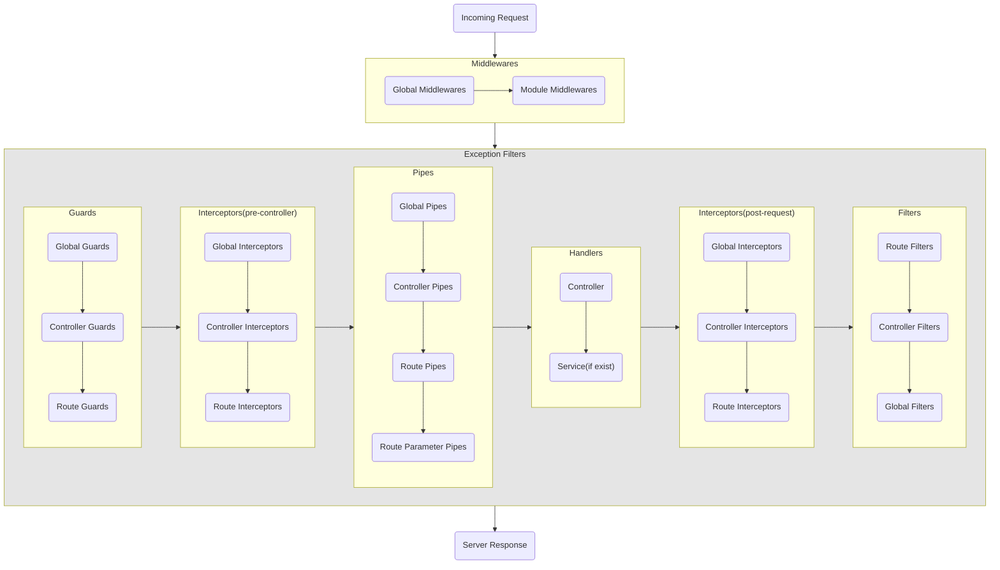

# NestJS Logger Bolierplate

- libs : nest-winston, winston, winston-daily-rotate-file

## NestJS Request LifeCycle




## elk-docker

```conf
# filepath : docker/.env

ELASTIC_VERSION = 8.11.4
ELASTIC_PASSWORD = pwd-elastic
LOGSTASH_INTERNAL_PASSWORD = pwd-logstash
KIBANA_SYSTEM_PASSWORD = pwd-kibana
METRICBEAT_INTERNAL_PASSWORD = pwd-metricbeat
FILEBEAT_INTERNAL_PASSWORD = pwd-filebeat
HEARTBEAT_INTERNAL_PASSWORD = pwd-heartbeat
MONITORING_INTERNAL_PASSWORD = pwd-monitoring
BEATS_SYSTEM_PASSWORD = pwd-beats
```

```bash
cd docker

docker-compose up setup
docker-compose up -d
```

- elk : 9200
- logstash : 5044
- kibana : 5601
